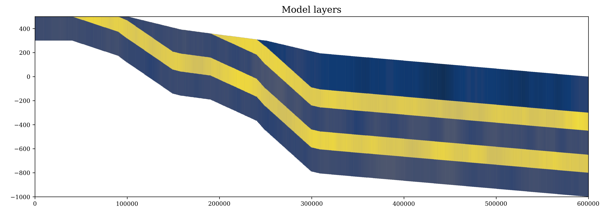

# ConfinedLab-mlibs

**MODFLOW 6 modelling utilities for synthetic multilayer groundwater systems.**

Developed at **Bordeaux INP, Lab EPOC, Université de Bordeaux**  
As part of the **ConfinedLab** project, funded by the [PEPR One Water DEESAC project](https://www.onewater.fr/fr/actualite/actualite/lancement-du-projet-deesac-durabilite-exploitabilite-des-eaux-souterraines-des "Go to onewater.fr")  
Author: **MARIN RIVERA Carlos Felipe**

---

## What is this?

`mlibs` is a Python package providing modular, reusable utilities for building, parameterising, and visualising **MODFLOW 6** groundwater models. It is designed around synthetic multilayer confined aquifer systems, covering the full workflow from geometry generation to transient results analysis.

---

## Modules

| Module | Description |
|---|---|
| `modgeom6` | Generate structured grids from defined geometries: idomain arrays, top/bottom elevations, thickness, recharge, layer subdivision |
| `modbound6` | Create boundary condition stress period data: rivers (RIV), general head (GHB), drains (DRN) |
| `modpar6` | Generate spatially correlated random fields of hydraulic parameters (K, Sy, Ss) using FFT-based simulation |
| `modplot6` | Visualise model grids, heads, cross-sections, boundary conditions, and budget summaries |
| `modpump6` | Analyse steady-state pumping scenarios: iterate pumping rates, capture rates, and water budgets |
| `modtransient6` | Process and visualise transient results: time-series heads, flows, storage release, zone budgets |

---

## Installation

### Requirements

- Python >= 3.9
- numpy >= 1.26
- scipy >= 1.12
- matplotlib >= 3.9
- flopy >= 3.8
- pandas >= 2.0
- geopandas >= 1.0
- shapely
- imageio >= 2.36
- scikit-learn >= 1.6

### Local install (recommended for development)

Clone the repository and install in editable mode. Any changes you make to the files are immediately available — no reinstall needed.

```bash
git clone https://github.com/femarivera/ConfinedLab-mlibs.git
cd ConfinedLab-mlibs
pip install -e .
```

### Install directly from GitHub

```bash
pip install git+https://github.com/femarivera/ConfinedLab-mlibs.git
```

---

## Quick start

### Geometry generation

```python
import numpy as np
from mlibs import modgeom6, modplot6

# Define grid dimensions
nlay, nrow, ncol = 5, 1, 600
epsilon = 0  # Minimum allowed cell thickness (m)

# Define layer geometry
outcrop_z    = np.array([100, 150, 200, 250, 350])  # Outcrop elevations (m), used when slope=False
outcrop_zmax = np.array([200, 300, 400, 500, 500])  # Max outcrop elevations (m), used when slope=True
outcrop_zmin = np.array([  0, 200, 300, 400, 500])  # Min outcrop elevations (m), used when slope=True
base_thicknesses = np.array([300, 150, 200, 150, 200])  # Layer thicknesses (m)
outcrop_cells    = np.array([200, 150, 100,  50,   0])  # Outcrop column indices
transition = 50  # Number of transition cells

# Build geometry arrays
idomain = modgeom6.compute_idomain(nlay, nrow, ncol, outcrop_cells)
ztop = modgeom6.compute_top(
    idomain, outcrop_z,
    transition=True, slope=True,
    transition_cells=transition, transition_type="contain",
    outcrop_zmin=outcrop_zmin, outcrop_zmax=outcrop_zmax
)
thickness_array = modgeom6.compute_thickness(
    idomain, base_thicknesses,
    transition=True, transition_type="contain",
    transition_cells=transition
)
zbot    = modgeom6.compute_bottom(ztop, thickness_array)
idomain = modgeom6.idomain_from_thickness(thickness_array, epsilon)

# --- flopy simulation building section ---

modplot6.plot_cross_section_array(
    gwf, zone_array, nrow // 2,
    figsize=(19, 5), fontsize=14, label="Model layers"
)
```


### Hydraulic parameter fields

```python
from mlibs import modpar6

# Estimate log-normal distribution parameters from known percentiles
# e.g. K ranges from 1e-5 to 1e-3 m/s across the 5th-95th percentile
geom_mean, mu, sigma2, sigma = modpar6.moments_from_percentiles(
    k1=1e-5, p1=0.05,
    k2=1e-3, p2=0.95
)

# Generate a 2D spatially correlated K field
K_field = modpar6.generate_random_field(
    shape=(nrow, ncol),
    variogram_type="exponential",
    geom_mean=geom_mean,
    sill=sigma2,
    range_param=15.0,  # Correlation length in model units
    seed=42
)
```

---

## Module overview

### `modgeom6` — Geometry

Functions to build the 3D grid structure of a synthetic multilayer system.

```python
modgeom6.compute_idomain(nlay, nrow, ncol, outcrop_cells, direction)
modgeom6.compute_top(idomain, outcrop_z, transition, slope, direction, ...)
modgeom6.compute_thickness(idomain, base_thicknesses, transition, ...)
modgeom6.compute_bottom(ztop, thickness_array)
modgeom6.compute_irch(idomain)
modgeom6.compute_recharge(irch, R)
modgeom6.subdivide_layers(idomain, ztop, zbot, nsub_layers)
modgeom6.insert_soil_layer(ztop, zbot, idomain, soil_thickness)
```

### `modpar6` — Parameter fields

Generate spatially correlated random fields from prior knowledge of hydraulic properties.

```python
modpar6.moments_from_percentiles(k1, p1, k2, p2)
modpar6.moments_from_arithmetic_mean_variance(arith_mean, arith_var)
modpar6.moments_from_log_mean_variance(log_mean, log_var, log_base)
modpar6.generate_random_field(shape, variogram_type, geom_mean, sill, nugget, range_param, ...)
modpar6.stack_fields_to_3D(field_list, nlay, nrow, ncol)
```

### `modbound6` — Boundary conditions

Create stress period data arrays for MODFLOW 6 boundary packages (RIV, GHB, DRN).

### `modplot6` — Plotting

Visualise model structure, results, and budget components for steady-state and transient simulations.

### `modpump6` — Pumping analysis

Automate pumping rate iteration and analyse captured discharge and induced recharge in steady-state models.

### `modtransient6` — Transient analysis

Extract and visualise time-series data, storage release proportions, and zone water budgets from transient runs.

---

## Repository structure

```
ConfinedLab-mlibs/         <- repository root
├── mlibs/                 <- installable package
│   ├── __init__.py
│   ├── modgeom6.py
│   ├── modbound6.py
│   ├── modpar6.py
│   ├── modplot6.py
│   ├── modpump6.py
│   └── modtransient6.py
├── pyproject.toml
├── LICENSE
└── README.md
```

---

## License

This project is licensed under the BSD 3-Clause License — see the [LICENSE](LICENSE) file for details.

---

## Contact

For questions, suggestions, or contributions, please contact:

**Carlos Felipe Marin Rivera**  
Bordeaux INP, UMR 5805 Lab EPOC, Université de Bordeaux  
cmarinriver@bordeaux-inp.fr

<p float="left">
  
  
  
</p>